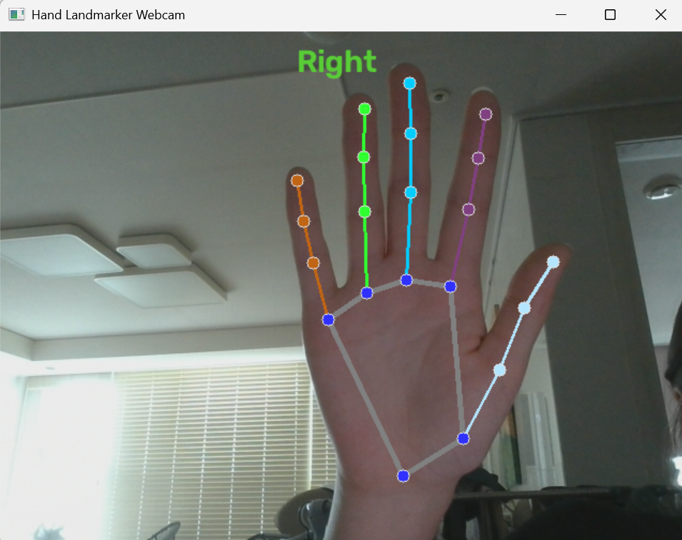
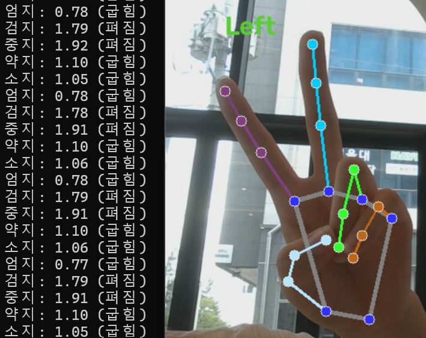

# Webcam + MediaPipe 손 인식
이미지 테스트(`hands_example.py`) 이후, 웹캠(실시간 프레임)처리로 넘어가면서 배운 내용 정리  

## 1. RunningMode: IMAGE vs VIDEO vs LIVE_STREAM
MediaPipe Tasks API는 입력 종류에 따라 세 가지 모드를 구분한다. 
- IMAGE: 정지 이미지 한 장 (타임스탬프/트래킹 없음)
- VIDEO: 연속 프레임 + 타임스탬프, 동기 호출(`detect_for_video`) 
    - 웹캠이든 영상 파일이든 프레임을 순서대로 넣기만 하면 동일하게 적용됨 (비디오 파일 전용이 아니라 연속 프레임 입력을 뜻함)
- LIVE_STREAM: 연속 프레임, 비동기 콜백(`detect_async` + `result_callback`)
    - 실시간성은 더 좋으나 구조가 복잡함

## 2. 타임스탬프
`detect_for_video(image, timestamp_ms)`는 프레임마다 밀리초 단위 타임스탬프가 필요하며, 반드시 단조 증가해야 함. 프레임 메타데이터 대신 `time.time() - start_time` 기반으로 직접 계산해도 무방 

```python
start_time = time.time()
...
timestamp_ms = int((time.time() - start_time) * 1000)
```

## 3. 웹캠 캡처 루프 구조
```python
cap = cv2.VideoCapture(0)

while cap.isOpened():
    ret, frame = cap.read()
    if not ret:
        break

    rgb_frame = cv2.cvtColor(frame, cv2.COLOR_BGR2RGB)
    mp_image = mp.Image(image_format=mp.ImageFormat.SRGB, data=rgb_frame)
    timestamp_ms = int((time.time() - start_time) * 1000)
    detection_result = detector.detect_for_video(mp_image, timestamp_ms)
    # ... 그리기 + imshow는 hand_landmarks 유무와 무관하게 매 프레임 호출
    if cv2.waitKey(1) & 0xFF == ord('q'):
        break

cap.release()
cv2.destroyAllWindows()
```
- `mp.Image.create_from_file`은 디스크 파일 전용 -> 웹캠 프레임은 이미 메모리의 numpy 배열이므로 `mp.Image(image_format=..., data=...)`생성자로 직접 감싸야 함 
- `cv2.imshow`를 `if hand_landmarks:` 블록 안에 넣으면 손이 인식 안된 프레임에서 화면이 멈추는 버그 발생 -> 항상 루프 최상위에서 호출 

## 4. hand_landmarks vs hand_world_landmarks
| 구분 | hand_landmarks | hand_world_landmarks |
|---|---|---|
| 좌표계 | 이미지 정규화 (0~1) | 실제 3D 공간 (미터, 손목 중심 기준) |
| 용도 | 화면에 그리기 (픽셀 위치 변환 가능) | 거리/각도 등 기하 계산 |
| 원근 왜곡 | 큼 (카메라 시점에 영향받음) | 상대적으로 적음 |

**그리기용과 계산용을 분리해서 써야 함** -> 계산에 이미지 좌표를 쓰면 카메라 각도에 따라 결과가 왜곡됨.

## 5. 손가락 펴짐/굽힘 판단 로직
### 방식: 거리 비율
`(손목 ↔ 손끝 거리) / (손목 ↔ MCP 거리)` — 비율이 크면 펴짐, 작으면 굽힘.

```python
def calculate_distance(landmark1, landmark2):
    return np.sqrt(
        (landmark2.x - landmark1.x) ** 2 +
        (landmark2.y - landmark1.y) ** 2 +
        (landmark2.z - landmark1.z) ** 2
    )
```

z축을 포함한 3D 거리로 계산해야 함 —> 손가락이 카메라 광축과 평행할 때(카메라를 향해 찌르는 자세) 2D 거리만 쓰면 원근 때문에 "굽힘"으로 오판됨.

### 손가락별 랜드마크 인덱스

```python
WRIST = 0
FINGERS = {
    "검지": (5, 8),
    "중지": (9, 12),
    "약지": (13, 16),
    "소지": (17, 20),
}
```

엄지(1,2,3,4)는 나머지 4개와 움직이는 축이 달라(마주보기 운동) 손목 기준 거리 비율이 잘 안 맞음. 대신 **새끼손가락 MCP(17번)** 를 기준점으로 사용:

```python
PINKY_MCP = 17
THUMB_MCP = 2
THUMB_TIP = 4
# thumb_ratio = dist(pinky_mcp, thumb_tip) / dist(pinky_mcp, thumb_mcp)
```

## 6. 실습 결과 
1. `hands_webcam.py`


2. `finger_extension_test.py`

- 검지 비율(2D, `hand_landmakrs`): 방식 자체는 작동하지만 손가락이 카메라쪽을 향하면 굽힘으로 오판되는 문제 발생 
- z축 추가 + `hand_world_landmarks`로 전환 후: 회전에 대해 어느정도 개선됨 
- 굽힘 상태에서 회전각이 커지면 값(비율)이 올라가 편 상태 범위와 겹치는 문제 발생 
- 5개 손가락(검지, 중지, 약지, 소지, 엄지) 전부 펴짐/굽힘 라벨 출력까지 완성, 정상 동작 확인 

### 실험으로 정한 threshold

- `FINGER_EXTENDED_THRESHOLD = 1.5` (검지 기준 실험, 편 상태 1.6~1.95대 / 굽힘 상태 1.2~1.45대)
- `THUMB_EXTENDED_THRESHOLD = 1` (엄지 기준 실험, 편 상태 1.2~1.4대 / 굽힘 상태 0.7~0.9대)


## 7. 제약사항
- 거리 비율(world_landmarks + 3D) 방식은 펴짐 상태는 손 회전에는 잘 동작하지만, 굽힘 상태는 손 회전 각도가 커지면 펴짐 상태 값과 겹치는 한계가 있었음 
- 원인 추정: 굽힌 손가락은 카메라에서 가려지는 부분이 많아, 회전 시 모델의 z 추정 오차가 더 커짐
- 대응: 실제 기기는 카메라-손 각도를 정면~약간 비스듬한 범위로 제한한다는 전제로 진행. 문제가 생기면 관절 각도 기반 방식으로 전환 고려 

## 8. 파일 구조
- `src/hands_webcam.py`: 웹캠 + 손 랜드마크 시각화 (이미지 테스트 코드의 웹캠 버전)
- `src/finger_extension_test.py`: 손가락 펴짐/굽힘 판단 로직 실험 스크립트

## 9. 오늘 이해한 것 
- IMAGE 모드와 달리 웹캠(연속 프레임)은 RunningMode(VIDEO/LIVE_STREAM)와 타임스탬프 개념이 추가로 필요함 
- `hand_landmarks`(이미지 좌표, 그리기용)와 `hand_world_landmarks`(3D 미터 좌표, 계산)를 용도에 따라 분리해서 써야함 
- 엄지는 나머지 4개 손가락과 움직이는 축이 달라 손목이 아닌 새끼손가락 MCP(17번)를 기준점으로 삼아야 함 

## 10. 다음에 해야할 것 
- 5개 손가락 상태 조합을 실제 제스처(주먹/보자기/브이 등)로 매핑하는 규칙 설계 
- 검증된 로직을 `finger_state.py` 모듈로 분리 (실험 스크립트와 실제 로직 분리)
- LIVE_STREAM 모드 전환은 보류 (지연시간 이슈 발생 시, 최적화 단계에서 전환 고려) 
