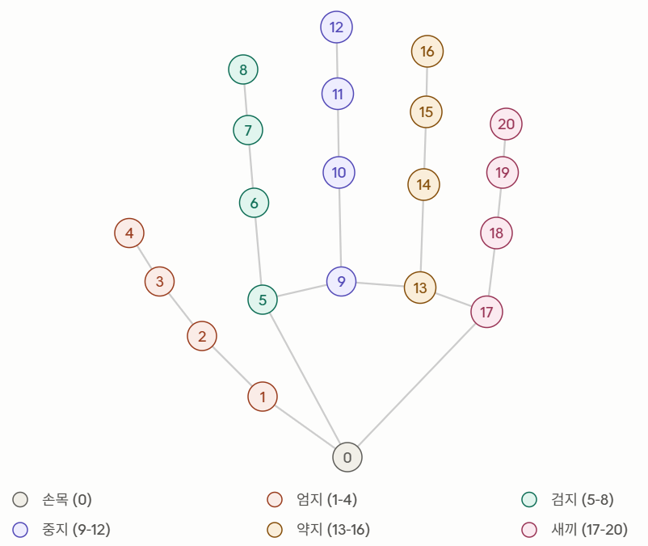
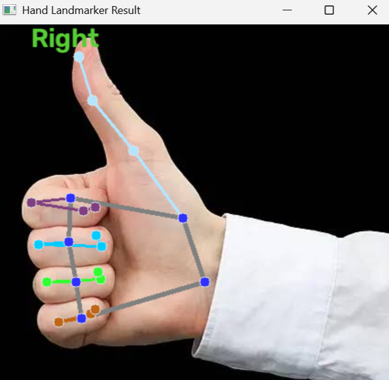

# MediaPipe Hand Landmarkder 
> 출처 : [Hand landmarks detection guide (Google AI Edge)](https://ai.google.dev/edge/mediapipe/solutions/vision/hand_landmarker)

## 1. 개요
MediaPipe Hand Landmarker는 이미지 안에서 손의 랜드마크(주요 지점)를 감지하는 task다.
정적 이미지 또는 연속된 영상 스트림 모두에서 동작하며, 아래 세 가지를 출력한다.  
- 이미지 좌표계 기준 손 랜드마크
- 월드 좌표계 기준 손 랜드마크 
- 왼손/오른손 여부 (handedness)

## 2. 참고 링크
| 플랫폼 | 코드 예제 | 가이드 |
|---|---|---|
| Python | [Colab 예제](https://colab.research.google.com/github/googlesamples/mediapipe/blob/main/examples/hand_landmarker/python/hand_landmarker.ipynb) | [가이드](https://developers.google.com/edge/mediapipe/solutions/vision/hand_landmarker/python) |
| Web | [코드](https://github.com/google-ai-edge/mediapipe-samples-web/blob/main/src/tasks/hand-landmarker.ts) | [가이드](https://developers.google.com/edge/mediapipe/solutions/vision/hand_landmarker/web_js) |
| Android | [코드](https://github.com/google-ai-edge/mediapipe-samples/tree/main/examples/hand_landmarker/android) | [가이드](https://developers.google.com/edge/mediapipe/solutions/vision/hand_landmarker/android) |

## 3. 입력/출력
입력으로 받을 수 있는 것   
- 정지 이미지
- 디코딩된 비디오 프레임
- 라이브 영상 피드(웹캠 등)

출력되는 것   
- 감지된 손의 handedness(왼손/오른손)
- 이미지 좌표계 기준 랜드마크 (카메라 화면 안에서 손가락 점이 어디에 찍혔는지 나타내는 좌표)
- 월드 좌표계 기준 랜드마크 (손 자체를 기준으로 한 3D 좌표)

## 4. 설정 옵션 (Configuration options)
| 옵션 이름 | 설명 | 값 범위 | 기본값 |
|---|---|---|---|
| `running_mode` | IMAGE(단일 이미지) /<br> VIDEO(디코딩된 영상) /<br> LIVE_STREAM(실시간 카메라, 비동기 콜백 필요) 중 선택 | `{IMAGE, VIDEO, LIVE_STREAM}` | `IMAGE` |
| `num_hands` | 동시에 감지할 최대 손 개수 | 1 이상 정수 | `1` |
| `min_hand_detection_confidence` | palm detection(손바닥 탐지) 모델의 최소 신뢰도 점수 | 0.0 ~ 1.0 | `0.5` |
| `min_hand_presence_confidence` | 손 랜드마크 모델에서 손이 실제로 존재한다고 판단하는 최소 신뢰도. Video/Live stream 모드에서 이 값보다 낮으면 palm detection을 다시 실행하고, 그렇지 않으면 가벼운 tracking 알고리즘으로 위치를 추적 | 0.0 ~ 1.0 | `0.5` |
| `min_tracking_confidence` | 손 추적 성공으로 간주할 최소 신뢰도(현재 프레임과 이전 프레임 bounding box IoU 기준). 이 값보다 낮으면 손 감지를 다시 트리거 | 0.0 ~ 1.0 | `0.5` |
| `result_callback` | LIVE_STREAM 모드에서 결과를 비동기로 받기 위한 리스너 설정 | N/A | N/A |

> **detection vs tracking** : detection 계열 confidence는 "손을 새로 찾을 때" 기준이고, tracking 계열 confidence는 "이미 찾은 손을 계속 따라갈 때" 기준이다. tracking이 실패해야 detection을 다시 돌리는 구조이기 때문에 이 두 값을 어떻게 잡느냐에 따라 속도/안정성이 갈린다.

## 5. 모델 구성
Hand Landmarker : Palm detection model + Hand landmarks detection model   
1. **Palm detection model**: 입력 이미지에서 손이 있는 위치(bounding box)를 찾음
2. **Hand landmarks detection model**: palm detection이 잘라낸 손 영역 안에서 21개 keypoint를 찾음

| 모델명 | 입력 크기 | 양자화 타입 |
|---|---|---|
| HandLandmarker (full) | 192×192, 224×224 | float16 |

- 학습 데이터: 실제 이미지 약 3만 장 + 다양한 배경에 합성한 렌더링 손 모델
- **속도 최적화 핵심**: palm detection은 연산 비용이 크기 때문에, Video/Live stream 모드에서는 이전 프레임의 랜드마크 결과로 만든 bounding box를 재사용해서 손 위치를 추적한다.
> 손이 화면에서 사라지거나 추적에 실패했을 때만 palm detection을 다시 실행 → 이게 실시간 처리가 가능한 이유

## 6. 21개 랜드마크 인덱스 


```
 0  WRIST (손목)

 1  THUMB_CMC        5  INDEX_FINGER_MCP     9  MIDDLE_FINGER_MCP
 2  THUMB_MCP        6  INDEX_FINGER_PIP    10  MIDDLE_FINGER_PIP
 3  THUMB_IP         7  INDEX_FINGER_DIP    11  MIDDLE_FINGER_DIP
 4  THUMB_TIP        8  INDEX_FINGER_TIP    12  MIDDLE_FINGER_TIP

13  RING_FINGER_MCP  17  PINKY_MCP
14  RING_FINGER_PIP  18  PINKY_PIP
15  RING_FINGER_DIP  19  PINKY_DIP
16  RING_FINGER_TIP  20  PINKY_TIP
```
- 좌표는 이미지 좌표계 기준일 땐 0~1로 정규화된 값(픽셀 좌표 아님), 월드 좌표계 기준일 땐 실제 미터 단위 3D 좌표 

## 7. Tasks API란?
### MediaPipe의 원래 구조: 그래프(graph) 기반 엔진

MediaPipe는 원래 C++로 만들어진 **그래프 기반 실시간 처리 엔진**이다. 여기서 "그래프"는 꺾은선 그래프가 아니라, "여러 작업 단계를 화살표로 이어놓은 구조"를 뜻한다 (공장 컨베이어 벨트처럼: 재료 투입 → 조립 → 도색 → 검사 → 포장).

- **노드(node)**: 각 작업 단계 (예: 손바닥 탐지, 랜드마크 검출)
- **연결선(edge)**: 노드 간 데이터가 흐르는 방향

MediaPipe Hands 내부적으로는 대략 이런 그래프로 동작한다.

```
웹캠 프레임 → 손바닥 탐지 → 랜드마크 검출 → 21개 좌표 출력
```
- 이 그래프를 개발자가 직접 하나하나 설계해야 하는 게 원래 MediaPipe Framework였는데, 너무 복잡해서 나온 게 아래 두 가지 상위 API다.

### Solutions API (레거시) vs Tasks API (현재 표준)

| | Solutions API | Tasks API |
|---|---|---|
| 네임스페이스 | `mp.solutions.*` | `mp.tasks.*` |
| 구조 | 태스크(손/포즈/얼굴)마다 API가 제각각 | 모든 태스크가 동일한 4단계 패턴 |
| 현재 상태 | 레거시 | 현재 표준 |

### Tasks API의 통일된 4단계 패턴

1. **모델 준비**: `.task` 파일 하나에 모델 + 설정 포함 (`hand_landmarker.task`)
2. **Options 설정**: `BaseOptions`(공통) + `HandLandmarkerOptions`(태스크별 설정: `num_hands`, `running_mode` 등)
3. **task 생성**: `create_from_options()`로 감지기 객체 생성
4. **실행**: `detect()` / `detect_for_video()` / `detect_async()` — IMAGE/VIDEO/LIVE_STREAM 모드에 따라 다름

이 패턴은 HandLandmarker뿐 아니라 PoseLandmarker, FaceLandmarker, ObjectDetector 등 다른 Tasks API 기능에도 동일하게 적용된다.

### 그리기 유틸리티는 두 가지가 공존함 
- `mp.solutions.drawing_utils`: 구버전, `landmark_pb2` protobuf 형식으로 변환해야 넘길 수 있음
- `mp.tasks.vision.drawing_utils`: 신버전(Tasks API 전용), 변환 없이 `hand_landmarks`를 바로 넘겨도 됨 — 실제 공식 콜랩 노트북이 사용하는 방식

## 8. 첫 실습 결과 
- 코드: 공식 Colab 노트북(STEP 1~5) + draw_landmarks_on_image 함수를 로컬용으로 그대로 사용 (cv2_imshow만 cv2.imshow로 교체)
- 테스트 사진 : 엄지만 편 상태
- 결과 : 21개 랜드마크 정상 감지, handedness "Right" 정확히 인식, 손가락별로 다른 색으로 자동 시각화됨

- 결론 : IMAGE 모드 기준 Hand Landmarker 첫 실습 완료 

## 9. 오늘 이해한 것  
- Tasks API가 왜 만들어졌는지 이해함 — MediaPipe Framework(그래프 기반 C++ 엔진)가 너무 로우레벨이라, Solutions API(태스크마다 API 제각각) → Tasks API(모든 태스크 동일한 4단계 패턴)로 발전
- import 스타일 두 가지 (`from mediapipe.tasks import python` 방식 vs `mp.tasks.vision.XXX` 직접 접근 방식)가 완전히 같은 클래스를 가리킨다는 것 확인 — 프로젝트 안에서는 전자로 통일하기로 함
- 랜드마크 좌표가 정규화된 값이라는 것 -> 실제 픽셀 위치로 쓰려면 이미지 width/height를 곱해서 변환해야 함

## 10. 다음에 해야할 것
- `min_hand_detection_confidence` vs `min_tracking_confidence` 값을 바꿔가며 실제 인식 안정성 차이 실험
- IMAGE 모드 → LIVE_STREAM 모드로 전환해서 웹캠 실시간 처리 구현 (`result_callback` 비동기 콜백 구조 이해 필요)
- `hand_world_landmarks`(실제 3D 미터 단위 좌표)와 `hand_landmarks`(정규화 좌표)를 각각 언제 써야 하는지 실험으로 비교
